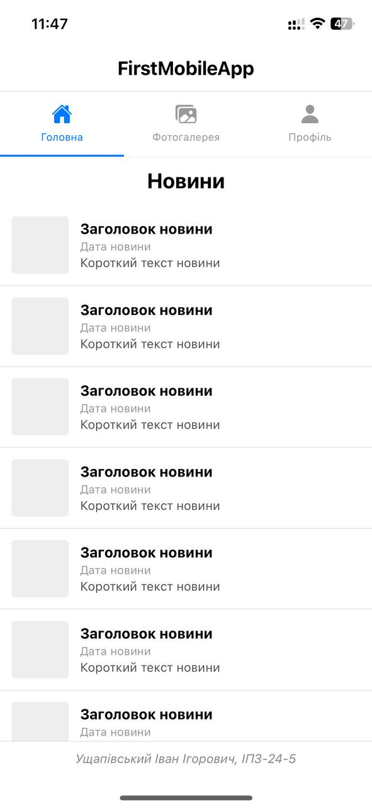
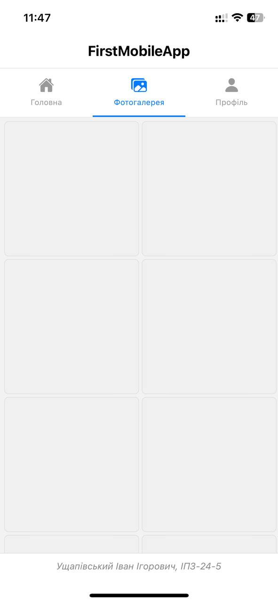
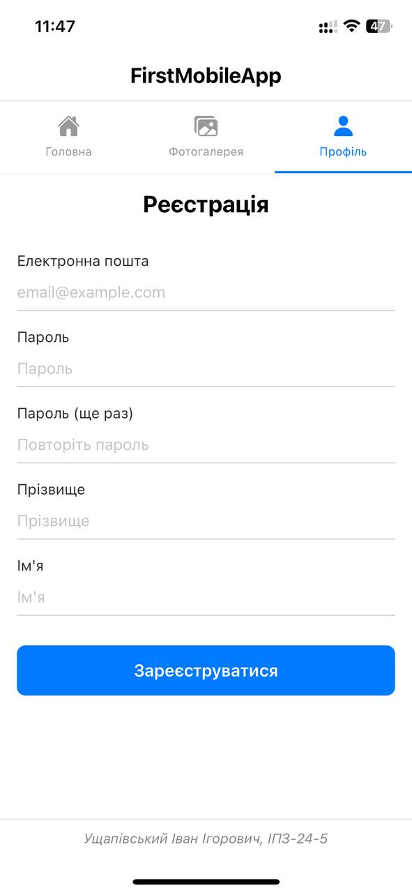

# FirstMobileApp — Лабораторна робота №1

## Опис проєкту
Мобільний додаток на React Native з використанням Expo. 
Додаток містить три екрани з навігацією між ними.

### Екрани:
- **Головна** — стрічка новин зі списком записів
- **Фотогалерея** — сітка фотографій у двох колонках
- **Профіль** — форма реєстрації користувача

## Автор
Ущапівський Іван Ігорович, ІПЗ-24-5

## Інструкція із запуску

### 1. Встановлення залежностей
```bash
npm install
```

### 2. Запуск проєкту
```bash
npx expo start
```

## Способи запуску мобільного додатку

### Expo Go (на реальному пристрої)
Найпростіший спосіб тестування. Після запуску `npx expo start` 
з'являється QR-код який сканується додатком Expo Go. 
Додаток працює через локальну мережу WiFi.
**Особливості:** телефон і комп'ютер мають бути в одній мережі.
**Обмеження:** потрібна сумісна версія Expo Go з версією SDK проєкту.

### Емулятор Android
Запуск через Android Studio з віртуальним пристроєм AVD.
**Особливості:** не потрібен реальний пристрій, займає багато RAM.
**Команда:** `npm run android`

### Веб-браузер
Запуск у браузері для швидкого перегляду інтерфейсу.
**Особливості:** деякі нативні функції можуть не працювати.
**Команда:** `npx expo start --web`

### Tunnel режим
Дозволяє тестувати додаток через інтернет (не тільки локальна мережа).
**Особливості:** корисно коли телефон і комп'ютер у різних мережах.
**Команда:** `npx expo start --tunnel`

## Скріншоти

### Головна


### Фотогалерея


### Профіль
