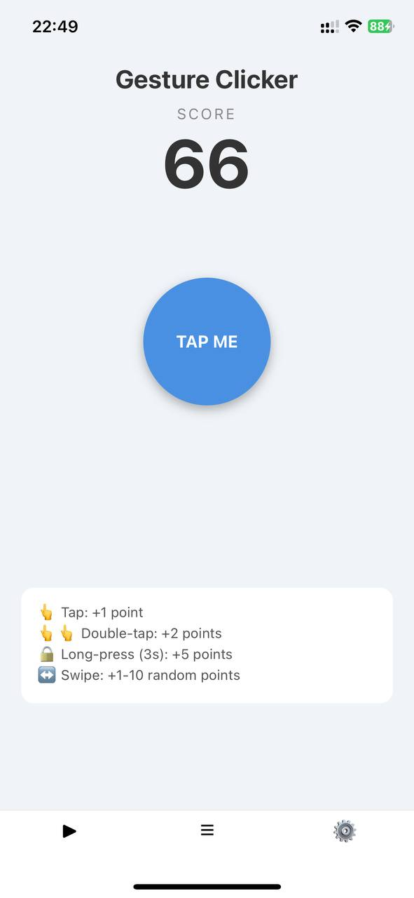
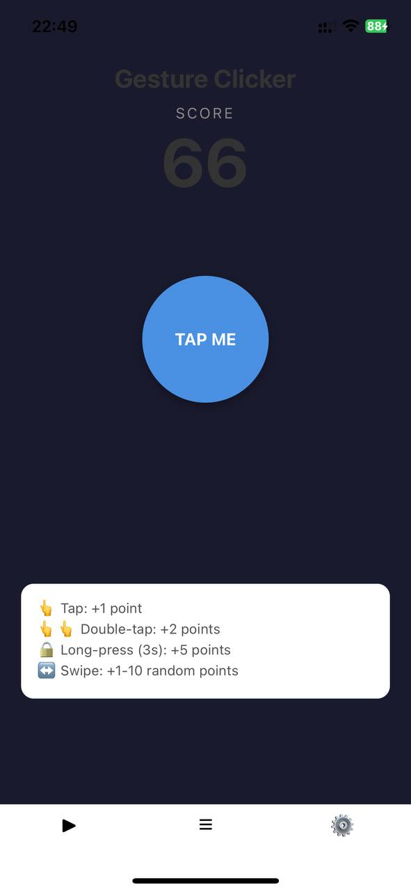
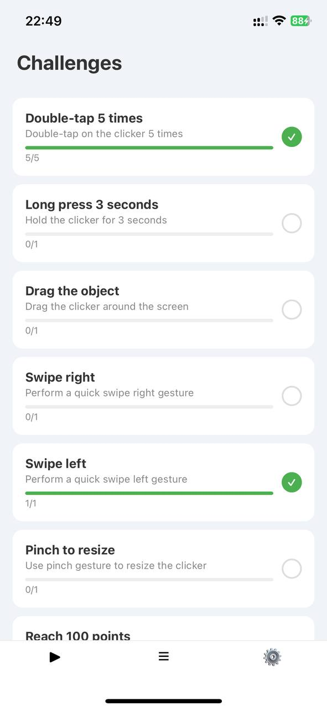
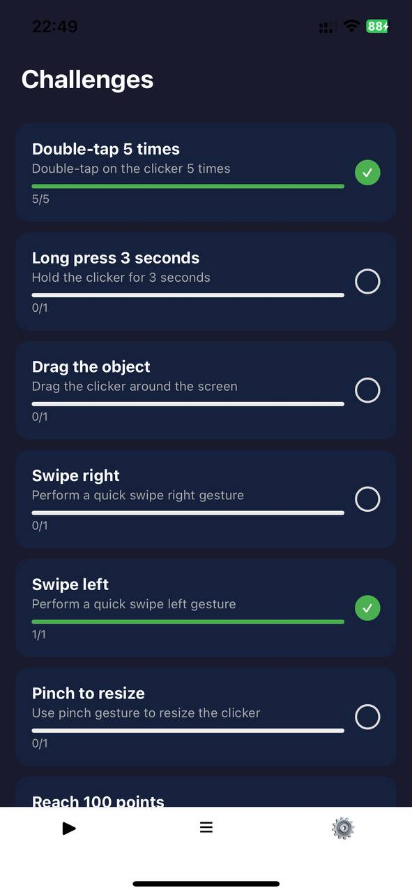
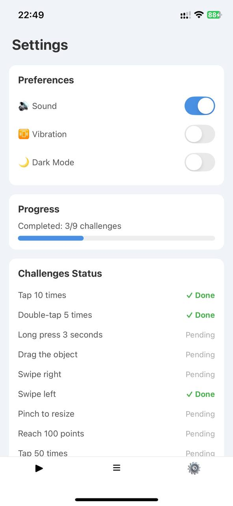
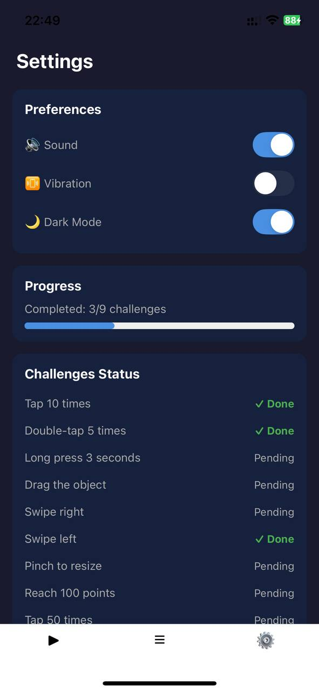

# Gesture Clicker — Лабораторна робота

## Опис проєкту

Мобільний додаток-гра "Gesture Clicker", розроблений на React Native з використанням Expo.
Додаток створений для розпізнавання та тестування різних типів жестів (натискання, подвійне натискання, утримання, свайпи, перетягування тощо). Додаток містить три екрани з нижньою панеллю навігації (Bottom Navigation) та підтримує зміну тем (світла/темна).

### Екрани:

* **Головний екран (Clicker)** — ігрова зона з основною кнопкою, лічильником балів та легендою, яка пояснює кількість балів за кожен тип жесту.
* **Виклики (Challenges)** — список інтерактивних завдань (досягнень) з індикаторами прогресу (наприклад, "Зробити свайп вліво", "Утримувати 3 секунди").
* **Налаштування (Settings)** — екран керування параметрами додатку (увімкнення/вимкнення звуку, вібрації, темного режиму), а також загальна статистика виконання викликів.

## Автор

Ущапівський Іван Ігорович, ІПЗ-24-5

## Інструкція із запуску

### 1. Встановлення залежностей

```bash
npm install

```

### 2. Запуск проєкту

```bash
npx expo start

```

## Способи запуску мобільного додатку

### Expo Go (на реальному пристрої)

Найпростіший спосіб тестування. Після запуску `npx expo start`
з'являється QR-код який сканується додатком Expo Go.
Додаток працює через локальну мережу WiFi.
**Особливості:** телефон і комп'ютер мають бути в одній мережі.
**Обмеження:** потрібна сумісна версія Expo Go з версією SDK проєкту.

### Емулятор Android

Запуск через Android Studio з віртуальним пристроєм AVD.
**Особливості:** не потрібен реальний пристрій, займає багато RAM.
**Команда:** `npm run android`

### Веб-браузер

Запуск у браузері для швидкого перегляду інтерфейсу.
**Особливості:** деякі нативні функції (наприклад, складні жести або вібрація) можуть працювати некоректно.
**Команда:** `npx expo start --web`

### Tunnel режим

Дозволяє тестувати додаток через інтернет (не тільки локальна мережа).
**Особливості:** корисно коли телефон і комп'ютер у різних мережах.
**Команда:** `npx expo start --tunnel`

## Скріншоти

### Головний екран (Clicker)



### Екран завдань (Challenges)



### Налаштування (Settings)


