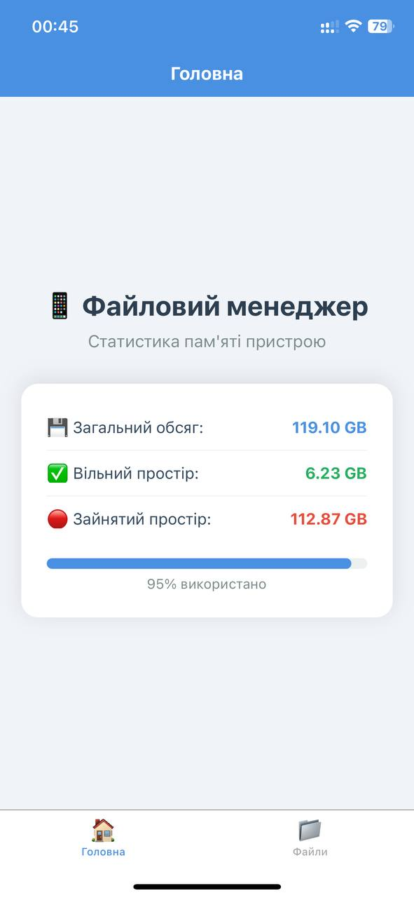
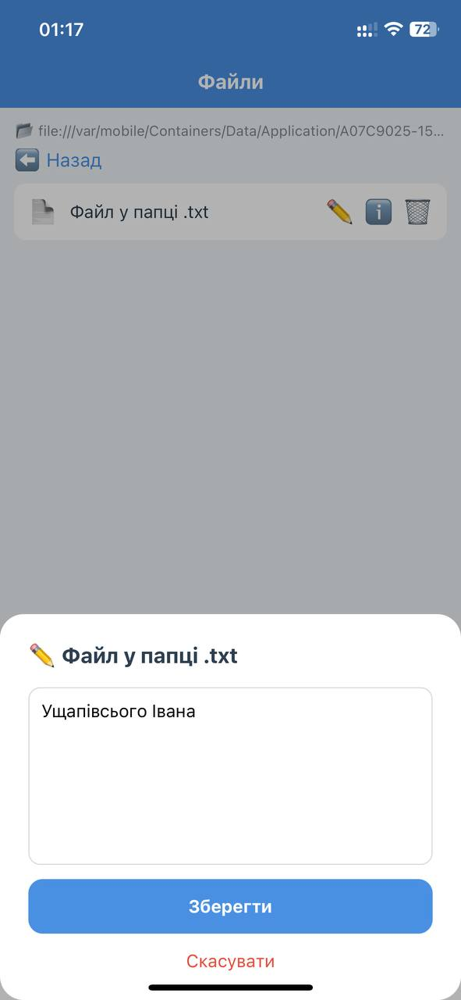
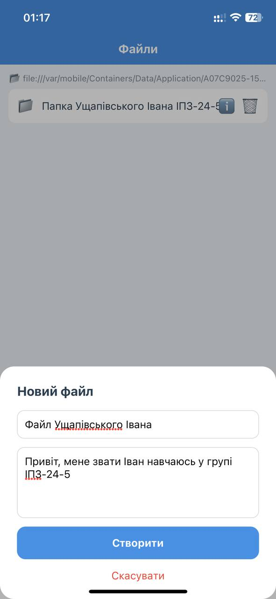
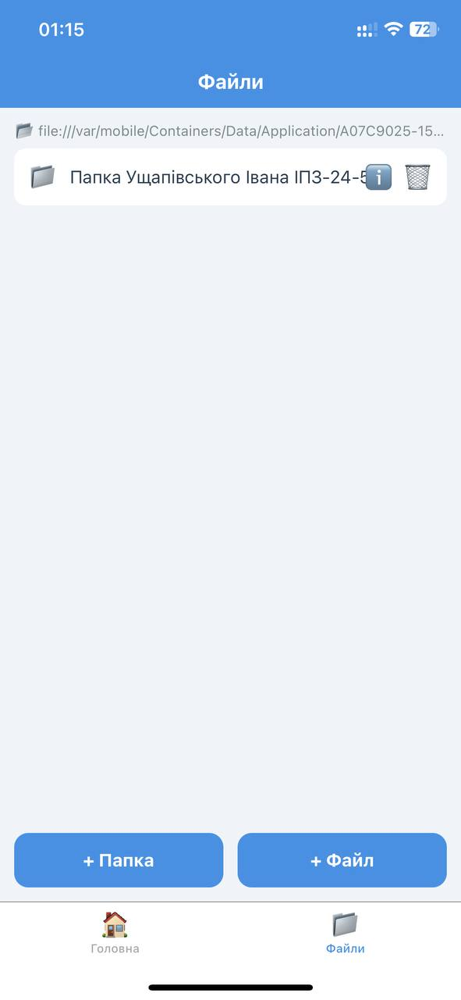
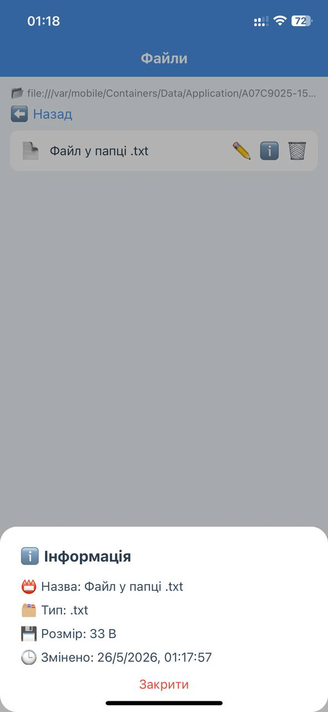
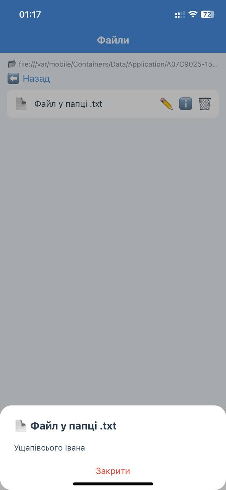

# Лабораторна робота №4 — Файловий менеджер

## Опис проекту
Мобільний додаток "Файловий менеджер", розроблений на React Native з використанням Expo та бібліотеки expo-file-system. Додаток реалізує повноцінну роботу з локальною файловою системою пристрою.

## Інструкція запуску

### Вимоги
- Node.js
- Expo Go (на телефоні)

### Кроки
1. Клонувати репозиторій:
```bash
git clone https://github.com/ipz245uii/MobileLabsRN2026.git
```
2. Перейти в папку проекту:
```bash
cd MobileLabsRN2026/lab4
```
3. Встановити залежності:
```bash
npm install
```
4. Запустити проект:
```bash
npx expo start
```
5. Відсканувати QR-код у додатку Expo Go на телефоні

## Реалізований функціонал

###  Головний екран
- Відображення загального обсягу пам'яті пристрою
- Відображення вільного простору
- Відображення зайнятого простору
- Прогрес-бар використання пам'яті

###  Екран файлів
- Навігація по локальній файловій системі
- Відображення поточного шляху
- Перехід у вкладені папки
- Кнопка повернення назад

###  Створення
- Створення нової папки з введеною назвою
- Створення нового текстового файлу (.txt) з вмістом

###  Зчитування
- Відкриття та перегляд вмісту .txt файлів

###  Редагування
- Редагування вмісту текстових файлів
- Збереження змін

###  Видалення
- Видалення файлів і папок
- Підтвердження перед видаленням

###  Інформація про файл
- Назва файлу
- Тип файлу (розширення)
- Розмір файлу
- Дата останньої модифікації

## Скріншоти

### Головний екран


### Доповнення файлів


### Створення файлу


### Створення папки


### Інформація про файл


### Читання файлів

