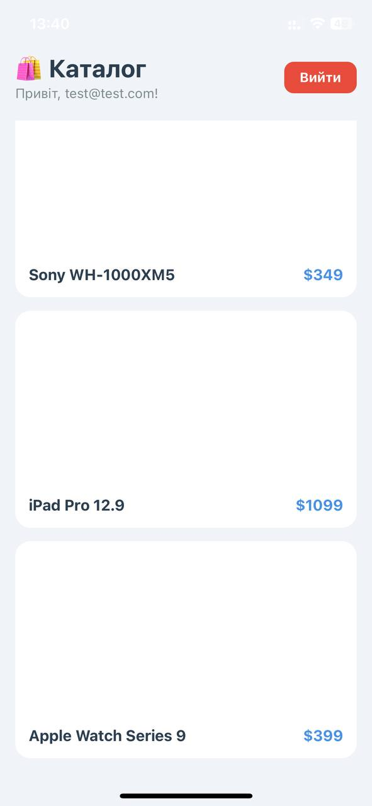
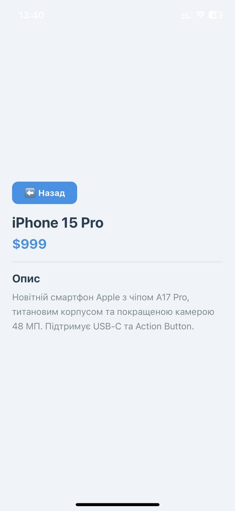
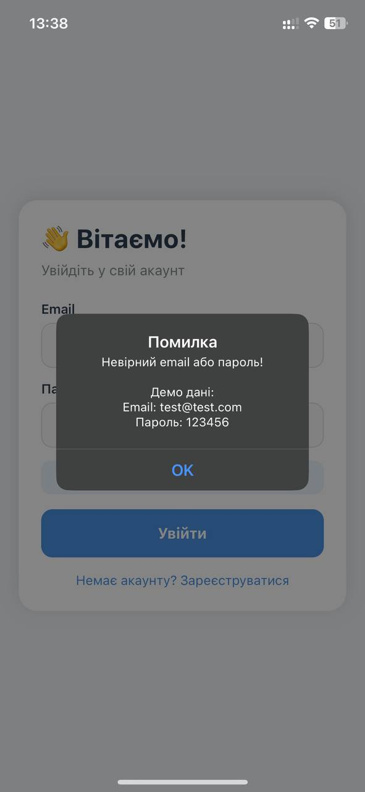

# Лабораторна робота №5 — Навігація з Expo Router

## Опис проекту
Мобільний додаток з авторизацією та каталогом товарів, розроблений на React Native з використанням Expo Router. Реалізована file-based маршрутизація, захищені маршрути та динамічні маршрути.

## Інструкція запуску

### Вимоги
- Node.js
- Expo Go (на телефоні)

### Кроки
1. Клонувати репозиторій:
```bash
git clone https://github.com/ipz245uii/MobileLabsRN2026.git
```
2. Перейти в папку проекту:
```bash
cd MobileLabsRN2026/lab5
```
3. Встановити залежності:
```bash
npm install
```
4. Запустити проект:
```bash
npx expo start
```
5. Відсканувати QR-код у додатку Expo Go на телефоні

### Демо дані для входу
- Email: test@test.com
- Пароль: 123456

## Реалізований функціонал

### 🔐 Авторизація
- Екран входу з валідацією полів
- Екран реєстрації з перевіркою паролів
- Глобальний контекст авторизації (AuthContext)
- Захищені маршрути — неавторизований користувач перенаправляється на екран входу

### 🛍️ Каталог товарів
- Список товарів з фото, назвою та ціною
- Використання FlatList для відображення списку
- Перехід на деталі товару при натисканні

### 📦 Деталі товару
- Динамічний маршрут /details/[id]
- Повна інформація про товар (фото, назва, ціна, опис)
- Кнопка повернення назад

### 🚫 Обробка помилок
- Екран 404 для неіснуючих маршрутів
- Валідація форм з повідомленнями про помилки

## Скріншоти

### Екран входу


### Екран реєстрації


### Каталог товарів


### Деталі товару


### Помилка входу


## Висновки

### Відповіді на контрольні запитання

**1. Яким чином за допомогою Expo Router реалізується перенаправлення неавторизованого користувача?**
У файлі `_layout.jsx` захищеної групи перевіряється стан `isAuthenticated`. Якщо користувач не авторизований, використовується компонент `<Redirect href="/login" />` для автоматичного перенаправлення.

**2. У чому полягає різниця між використанням компонента `<Link>` та метода `router.push()`?**
`<Link>` — це декларативний компонент для навігації, який використовується в JSX розмітці. `router.push()` — це програмний метод навігації, який викликається в обробниках подій (наприклад, після успішної авторизації).

**3. Як працюють динамічні маршрути в Expo Router і як отримати передані параметри?**
Динамічні маршрути створюються файлами з назвою у квадратних дужках, наприклад `[id].jsx`. Параметри отримуються за допомогою хука `useLocalSearchParams()`.

**4. Чому стан авторизації доцільно зберігати у глобальному контексті?**
Глобальний контекст дозволяє будь-якому компоненту мати доступ до стану авторизації без передачі пропсів через всі рівні компонентів. Це спрощує архітектуру і забезпечує єдине джерело істини.

**5. Для чого використовуються групи маршрутів і як вони впливають на URL-адресу?**
Групи маршрутів `(folderName)` дозволяють логічно організувати екрани без впливу на URL. Назва групи в дужках ігнорується в кінцевій адресі, тому `/( app)/index` доступний як `/`.