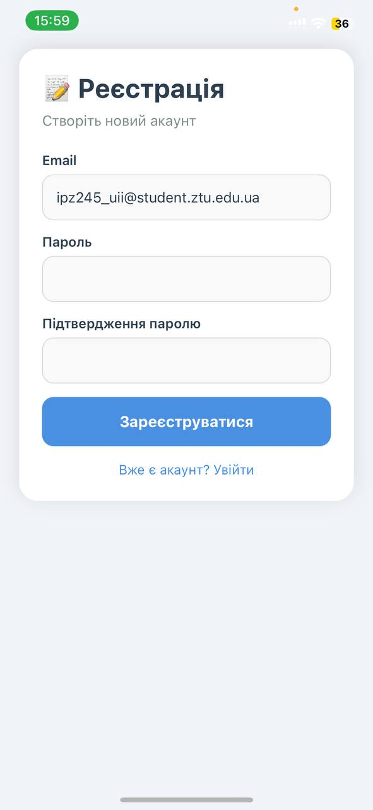
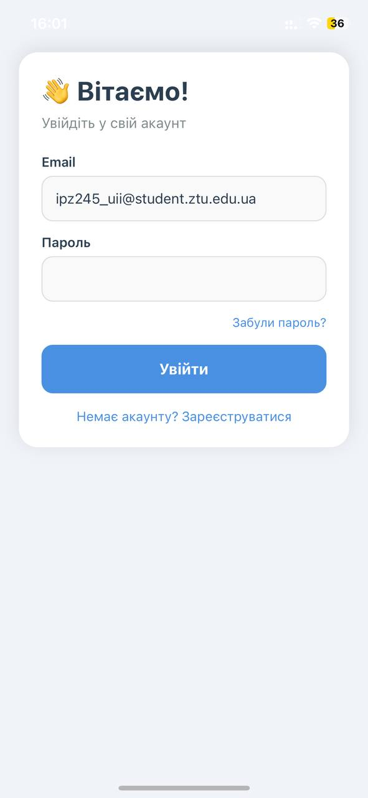
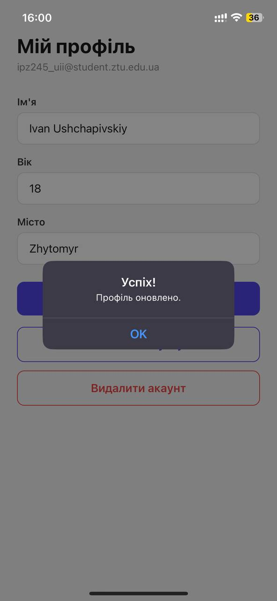
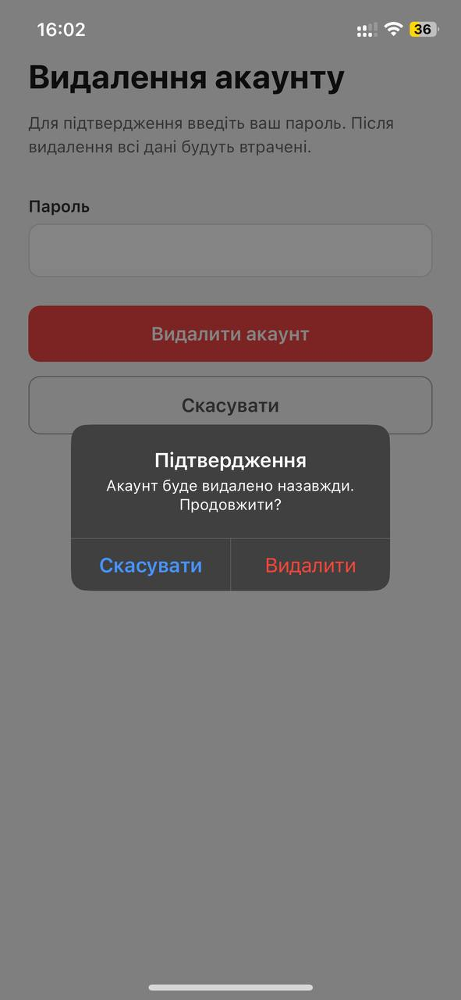
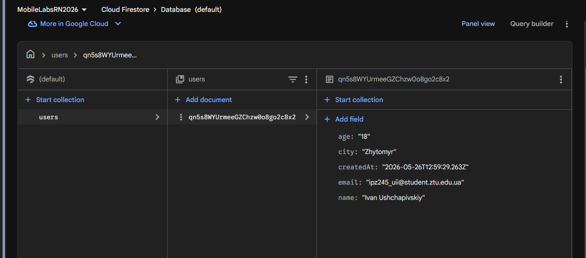

# Лабораторна робота №6

**Тема:** Побудова авторизації та збереження персональних даних у React Native з використанням Firebase Authentication та Firestore

## Інструкція запуску

### Вимоги
- Node.js >= 18
- Expo CLI
- Додаток Expo Go на телефоні (або емулятор)

### Кроки

```bash
# 1. Клонувати репозиторій
git clone https://github.com/MobileLabsRN2026/lab6.git
cd lab6

# 2. Встановити залежності
npm install

# 3. Запустити проект
npx expo start
```

Відсканувати QR-код у Expo Go (Android) або камерою (iOS).

---

## Реалізований функціонал

### 1. Авторизація користувача (Firebase Authentication)
- **Реєстрація** нового користувача за допомогою email та пароля з валідацією полів
- **Вхід** існуючого користувача з обробкою помилок
- **Вихід** із системи з підтвердженням через Alert

### 2. Збереження персональних даних (Firestore)
- Після реєстрації автоматично створюється документ у колекції `users` з `uid` як ID
- Користувач може заповнити/оновити профіль: ім'я, вік, місто
- Дані зберігаються у Firestore та завантажуються при кожному відкритті профілю

### 3. Захист доступу
- Клієнтська валідація: всі запити до Firestore виконуються з перевіркою `uid`
- Firestore Security Rules: користувач може читати та писати лише свій документ

```
rules_version = '2';
service cloud.firestore {
  match /databases/{database}/documents {
    match /users/{userId} {
      allow read, write: if request.auth != null && request.auth.uid == userId;
    }
  }
}
```

### 4. Редагування та видалення облікового запису
- Форма редагування профілю з можливістю оновити ім'я, вік, місто
- Кнопка "Видалити акаунт" з підтвердженням через Alert
- Повторна автентифікація (reauthentication) перед видаленням
- При видаленні очищається документ у Firestore та обліковий запис у Firebase Auth

### 5. Відновлення паролю
- Надсилання листа для скидання паролю через Firebase Auth (`sendPasswordResetEmail`)

### 6. Навігація (Expo Router)
- Захищені групи маршрутів: `(app)` для авторизованих, `(auth)` для неавторизованих
- `AuthContext` — централізоване керування станом авторизації
- Автоматичний редірект залежно від стану авторизації

---

## Скріншоти

### Реєстрація


### Вхід


### Профіль (збереження даних)


### Видалення акаунту


### Дані у Firebase Firestore


---

## Висновки

У ході виконання лабораторної роботи було набуто практичних навичок інтеграції Firebase у React Native застосунок. Реалізовано повний цикл авторизації: реєстрація, вхід, вихід та видалення акаунту з повторною автентифікацією. Персональні дані користувача зберігаються у хмарній базі даних Firestore з прив'язкою до унікального `uid`. Захист даних забезпечено як на рівні клієнтського коду, так і через Firestore Security Rules, що гарантує ізоляцію даних кожного користувача. Навігація реалізована через Expo Router з групами захищених маршрутів та централізованим контекстом авторизації.